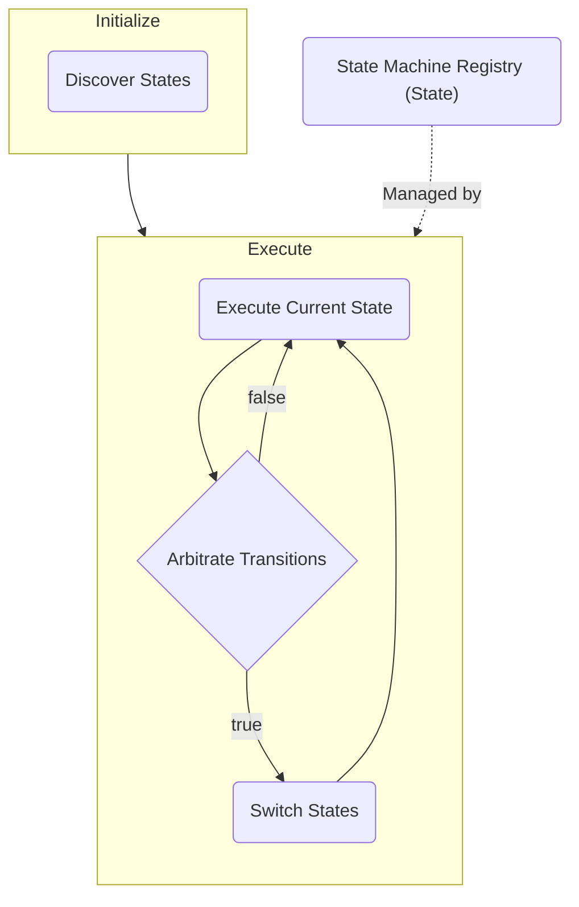

# State Machine Framework

HeadRoom requires a versatile character motion system that can be up- and down-scaled efficiently and seamlessly enough 
to accomodate to the core principle of ever-changing, always-innovative gameplay and level design. With such ambitious 
approach in mind, a hard-coded movement system won't cut it. This motivates the creation of an editor-enabled, flexible state machine-like behavior
that defines motion paradigms for (theoretically) infinite environment possibilities.

This state machine framework intends to lay the foundation of the movement system without ignoring the possibilities of
being used in other contexts such as AI or Quests.

## Overview

The state machine framework as a macro-pipeline that could be described as such:

for the movement system implementation check [MotionStateMachine.md](MotionStateMachine.md)