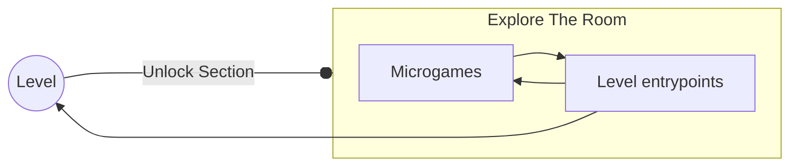
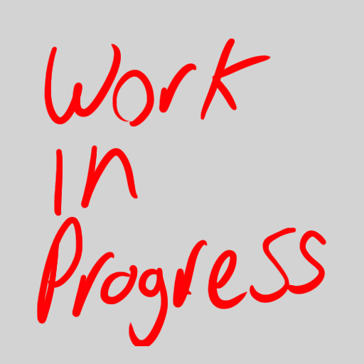

# Explore The Room

The room is a safe place that serves as a "Nexus" from which the player can access each level. The Room is presented as a
miniature Diorama viewed in a birds eye "isometric" perspective, there, the character moves and interacts with the objects present (named **microgames**).
Each microgame offers a unique interaction to the player with ranging levels of complexity: from simple reactivity to a complex minigame that evolves into a level (named **Entrypoint**).

The room Feels like a living place marked by all the memories the player has collected by playing the game, the more interactivity, the better, and some interactions should be persistent through
the whole gameplay, allowing even simple or complex progression in the context of such interaction (i.e: character bumps into a paper bin, crumpled paper balls stay there until player interacts with it and cleans it... or plays ball with them).

## Room Sections and In-Room Progression
The room is divided in **sections**, each **section** is represented and centered around a specific object that will take the player to a playable level (this is an **Entrypoint**) and
the section has either of two possible states depending on whether the associated level has been cleared:

> ### Locked State: 
>> - All other interactable objects (microgames) from this section are locked
>> - The associated Entrypoint object is sorounded by a graphical area that obscures all the other interactable objects from this section, this area doesn't affect the entrypoint

> ### Unlocked State:
>> - All other interactable objects (microgames) are unlocked and interactable
>> - The graphical area recedes to its center (the Entrypoint) until its gone and the environment looks normal

The Room's progression then, is determined by the amount of sections the player has unlocked; and signified by the absence of the locked state graphical areas. 

---

## Microgames

The microgames, other than being a play/gamefeel feature, they also help by serving 2 Specific purposes:

1. allowing the section's level to be replayed after the room evolves (achieved just by playing it)
2. unlocking a previously locked area in their section's level (achieved by doing a specific goal inside the microgame's microgame)

## Entry Minigame

Some Interactable objects are more than just minigames **microgames**, playing it will serve two purposes:

1. Provide a quick tutorial of the Level's gimmick
2. Provide a seamless transition to the level

once a level has been cleared, there is no more transitions, allowing the player to play the minigame freely.